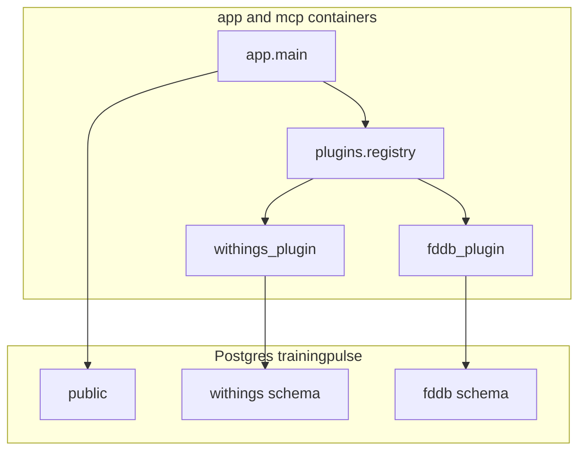
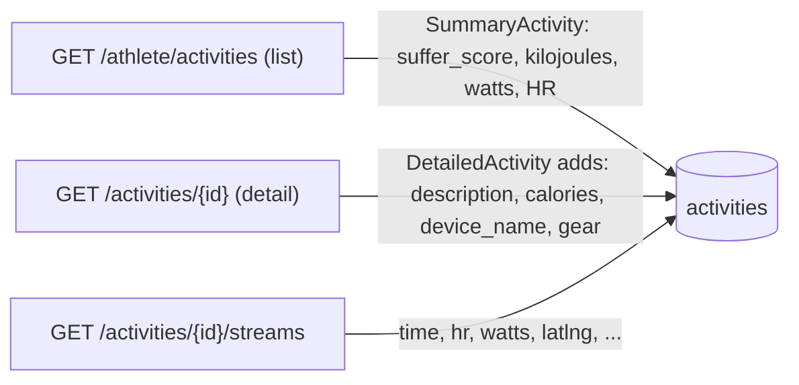

# Developer notes

Technical reference for **TrainingPulse**. Day-to-day setup lives in [`README.md`](README.md); this file covers architecture, the Strava endpoints we touch, the HTTP API, environment variables, and how training metrics are calculated.

## Architecture

```
Strava API → [app/ FastAPI core] → PostgreSQL (trainingpulse)
Optional plugins (withings, fddb) → PostgreSQL schemas `withings`, `fddb` in POSTGRES_DB
Grafana → provisioned Postgres datasource
MCP → same database as core (+ plugin schemas when enabled)
```

The core service in [`app/`](app/) handles Strava OAuth, APScheduler sync, TRIMP/CTL/ATL/TSB, and the status UI. Optional plugins under [`plugins/`](plugins/) are loaded in-process via [`app/plugins/registry.py`](app/plugins/registry.py) when listed in `ENABLED_PLUGINS` and fully configured — they are not separate containers.

Shared helpers live in [`packages/trainingpulse_common/`](packages/trainingpulse_common/) (async DB factories, `SimpleSyncState`, MCP readonly sessions).



### Plugin HTTP routes

| Plugin | Prefix | Notes |
|--------|--------|-------|
| Withings | `/plugins/withings` | OAuth at `/auth/withings`, callback `/get_token` |
| FDDB | `/plugins/fddb` | Cookie-based scrape; no OAuth |

Grafana addon dashboards in [`grafana/dashboards/addons/`](grafana/dashboards/addons/) query Postgres directly (no Infinity HTTP layer).

## Strava endpoints and the fields they provide

A single activity is assembled from three separate Strava endpoints. The list endpoint is cheap (one call per 200 activities), but `description`, `calories`, `device_name`, and full `gear` info are only available on the per-activity detail endpoint — and streams are a third, separate per-activity call. That is why a full backfill costs roughly `2N + N/200` requests against Strava's 100 / 15-min and 1000 / day limits.



Backfill walks `GET /athlete/activities` page by page and upserts every activity **without** blocking pagination on detail calls. A separate pass then calls `GET /activities/{id}` for each row until calories, ride notes, kilojoules, and other detail-only fields are merged (tracked by `activities.strava_detail_synced`). Detail and stream fetches run with bounded concurrency and sleep on HTTP 429, so whatever does not fit in the current rate-limit window continues automatically on the next scheduled sync.

## HTTP API

| Method | Endpoint | Description |
|--------|----------|-------------|
| `GET`  | `/`                          | Status page with current sync progress and metrics. |
| `GET`  | `/auth/strava`               | Start the Strava OAuth flow. |
| `GET`  | `/auth/callback`             | OAuth redirect target; exchanges the code for tokens. |
| `GET`  | `/sync/status`               | JSON sync status (consumed by the status page poller). |
| `POST` | `/sync/trigger`              | Manually run an incremental sync. |
| `POST` | `/sync/full`                 | Full historical resync: re-lists all activities and reprocesses streams. |
| `POST` | `/sync/refresh-rate-limit`   | Make one lightweight Strava call to refresh rate-limit headers. |

## Environment variables

Defined in [`app/config.py`](app/config.py) and wired through [`docker-compose.yml`](docker-compose.yml).

| Variable | Default | Description |
|----------|---------|-------------|
| `STRAVA_CLIENT_ID` | — | Strava API client ID. |
| `STRAVA_CLIENT_SECRET` | — | Strava API client secret. |
| `APP_BASE_URL` | `http://localhost:8000` | Public URL of the app; used to build the OAuth callback. |
| `POSTGRES_USER` | `trainingpulse` | PostgreSQL username (core + plugin DBs). |
| `POSTGRES_PASSWORD` | `changeme` | PostgreSQL password. |
| `POSTGRES_DB` | `trainingpulse` | Core TrainingPulse database name. |
| `ENABLED_PLUGINS` | empty | Comma-separated: `withings`, `fddb`. |
| `DATABASE_URL` | compose-built | Async SQLAlchemy URL; required by core and plugins (`postgresql+asyncpg://…`). |
| `WITHINGS_CLIENT_ID` / `WITHINGS_CLIENT_SECRET` | — | Withings Partner app. |
| `WITHINGS_SYNC_INTERVAL_MINUTES` | `60` | Withings poll interval. |
| `FDDB_USER` / `FDDB_PW` / `FDDB_COOKIE` | — | FDDB scrape credentials. |
| `FDDB_SYNC_INTERVAL_MINUTES` | `60` | FDDB poll interval. |
| `MCP_PORT` | `8001` | Host port for the network-accessible MCP endpoint at `/mcp`. |
| `MCP_ALLOWED_HOSTS` | `localhost:*,127.0.0.1:*` | Comma-separated Host header allowlist for MCP DNS-rebinding protection. Add your homeserver hostname or LAN IP when connecting from another machine. |
| `SYNC_INTERVAL_MINUTES` | `15` | Background poll interval. |
| `SYNC_DETAIL_CONCURRENCY` | `5` | Parallel `GET /activities/{id}` requests during the detail-merge pass. Strava's 15-min quota is the real ceiling; higher values just keep workers fed. Set to `1` for sequential behavior. Not wired through compose by default — pass it via the `app` service `environment` if you want to tune it. |
| `SYNC_STREAMS_CONCURRENCY` | `5` | Parallel `GET /activities/{id}/streams` requests during stream processing. Same caveats. |
| `MAX_HR` | unset | Explicit Max HR override. See precedence below. |
| `REST_HR` | unset | Explicit Resting HR override. See precedence below. |
| `FTP` | unset | Explicit FTP override. See precedence below. |
| `DEFAULT_MAX_HR` | `190` (in compose) | Container-level default for Max HR; treated by the app as an override when set. |
| `DEFAULT_REST_HR` | `60` (in compose) | Container-level default for Resting HR; treated by the app as an override when set. |

## HR and FTP precedence

The app resolves Max HR, Resting HR, and FTP in this order for each value independently:

1. **Explicit env override** — `MAX_HR`, `REST_HR`, or `FTP` from the environment, if set.
2. **Compose-level default** — `DEFAULT_MAX_HR` or `DEFAULT_REST_HR` from the environment, if set. [`docker-compose.yml`](docker-compose.yml) provides these with built-in values of `190` and `60`, so out-of-the-box the app behaves as if Max HR / Resting HR were overridden. There is no `DEFAULT_FTP`.
3. **Strava profile** — for Max HR, the upper bound of your Strava heart-rate zones; for FTP, the `ftp` field on your athlete profile.
4. **Hard-coded fallback** — `190` for Max HR, `60` for Resting HR, `200` for FTP.

When Max HR or Resting HR resolves from steps 1 or 2, the app also ignores any custom HR zones from Strava and computes percentage-based zones from `MAX_HR` instead, so zones stay consistent with the override. To let Strava's profile values drive everything, unset both `MAX_HR` and `DEFAULT_MAX_HR` (and likewise for resting HR) in your environment before starting the stack.

Implementation: see `fetch_and_store_athlete_settings` in [`app/sync.py`](app/sync.py).

## Training metrics reference

Computed in [`app/metrics.py`](app/metrics.py) and stored alongside activities and in `daily_metrics`.

| Metric | Also known as | Description |
|--------|---------------|-------------|
| **TRIMP** | Relative Effort | Heart-rate zone-weighted training load per activity. For activities without HR data, a sport-based per-minute estimate is used instead. |
| **CTL** | Fitness | 42-day exponential moving average of daily TRIMP. |
| **ATL** | Fatigue | 7-day exponential moving average of daily TRIMP. |
| **TSB** | Form | `CTL − ATL`. Positive means fresh, negative means fatigued. |
| **Best 20m** | — | Highest average power sustained for 20 continuous minutes within an activity. |
| **Est. FTP** | — | 95% of the best 20-minute power. |

## MCP service

The `mcp` Compose service runs [`app/mcp_server.py`](app/mcp_server.py) and exposes streamable HTTP at:

```text
http://your-host:${MCP_PORT:-8001}/mcp
```

It is designed for Cursor or another MCP-aware client to ask conversational questions about local TrainingPulse data. The service is read-only and does not expose `strava_tokens`.

The MCP SDK validates incoming Host headers to protect against DNS rebinding. If you connect through a homeserver hostname or LAN IP, add it to `MCP_ALLOWED_HOSTS` in `.env`:

```dotenv
MCP_ALLOWED_HOSTS=localhost:*,127.0.0.1:*,homeserver.local:*,192.168.1.10:*
```

Use the same hostname in your MCP client URL, for example `http://homeserver.local:8001/mcp`.

Initial tools:

- `get_training_summary(start_date, end_date, sport_type?)`
- `compare_periods(period_a_start, period_a_end, period_b_start, period_b_end, sport_type?)`
- `list_activities(start_date?, end_date?, sport_type?, gear_name?, limit?)`
- `get_activity_detail(activity_id)`
- `get_gear_usage(start_date?, end_date?)`
- `get_sync_health()`

When plugins are enabled and configured, the same MCP server also exposes:

- **Withings:** `get_weight_summary`, `list_weight_measurements`, `get_latest_weight`, `compare_weight_periods`
- **FDDB:** `get_nutrition_summary`, `list_daily_nutrition`, `compare_nutrition_periods`, `get_fddb_sync_health`

Example Cursor MCP configuration:

```json
{
  "mcpServers": {
    "trainingpulse": {
      "url": "http://your-host:8001/mcp"
    }
  }
}
```

Because the MCP port is published on the host network like Grafana and the app, keep it on a trusted private network. Tool responses can include private activity names, dates, gear, HR, power, and training-load data. PostgreSQL remains internal to Docker Compose.

## Demo data

[`app/seed_demo_data.py`](app/seed_demo_data.py) populates the DB with ~12 months of fully synthetic, Strava-style activities so the Grafana dashboards can be screenshotted without exposing real training data. All rows belong to athlete id `99999999` and use activity ids in the `9000000000+` range. The script reuses [`app/metrics.py`](app/metrics.py) for TRIMP, HR / power zones, the power curve, and the CTL / ATL / TSB recalculation, so the seeded data renders identically to a real sync.

It also seeds `fddb.daily_nutrition` (one row per day) and `withings.weight_measurements` (morning weigh-ins; demo `grpid` values `9000000000+`). OAuth token tables (`strava_tokens`, `withings_tokens`) are never touched.

Run it inside the container:

```bash
docker compose build app && docker compose up -d app
docker compose exec app python seed_demo_data.py            # empty DB only; refuses otherwise
docker compose exec app python seed_demo_data.py --force    # wipe and reseed
```

Flags:

- `--days N` (default `365`): how far back to start the synthetic history.
- `--seed N` (default `42`): RNG seed so output is reproducible.
- `--force`: truncate `activities`, `activity_streams`, `daily_metrics`, and `athlete_settings` before seeding; also truncates `daily_nutrition` and demo `weight_measurements` (`grpid >= 9000000000`). `strava_tokens` and `withings_tokens` are never touched.

To remove the seeded rows later:

```sql
DELETE FROM activity_streams WHERE activity_id >= 9000000000;
DELETE FROM activities       WHERE athlete_id  = 99999999;
DELETE FROM daily_metrics    WHERE athlete_id  = 99999999;
DELETE FROM athlete_settings WHERE athlete_id  = 99999999;
```

```sql
TRUNCATE fddb.daily_nutrition;
DELETE FROM withings.weight_measurements WHERE grpid >= 9000000000;
```

The synthetic streams intentionally omit `latlng`, so the activity-detail map panel stays empty rather than implying a real location.

## Dashboard screenshots

[`grafana/take_screenshots.sh`](grafana/take_screenshots.sh) captures full-page PNGs of each Grafana dashboard by running the official Playwright Python container against the live stack. The screenshots write to [`screenshots/`](screenshots/) and use the bundled demo data when the DB has been seeded with [`app/seed_demo_data.py`](app/seed_demo_data.py).

Captured dashboards: `fitness.png`, `account_overview.png`, `activity_detail.png`, and `nutrition_training_weight.png` (the FDDB / Withings addon dashboard in Grafana’s **Addons** folder).

Prerequisites: the stack is running (`docker compose up -d`) and the DB has data. Then:

```bash
./grafana/take_screenshots.sh
```

The script picks the highest-TRIMP recent ride for the activity-detail dashboard, computes a tight time range that spans that activity (so HR / power / cadence streams render at full resolution), and uses `from=now-30d&to=now` for the fitness, account-overview, and addon dashboards. Override behavior via env vars listed at the top of the script (`ACTIVITY_ID`, `TIMERANGE`, `WIDTH`, `HEIGHT`, `WAIT_MS`, etc.). The Playwright image is pulled on first run; each invocation runs a quick `pip install playwright` inside the container (the base image ships Chromium but not the Python package).

## Source map

- Strava **Connect with Strava** button asset: [`app/static/assets/btn_strava_connect_with_orange.png`](app/static/assets/btn_strava_connect_with_orange.png) — official artwork from the Strava API docs site (`btn_connectWith.png` at `https://strava.github.io/api/images/`). Do not substitute a custom-drawn button if you need to stay within Strava’s brand rules.

- OAuth flow, status page, scheduler wiring: [`app/main.py`](app/main.py)
- Read-only MCP tools: [`app/mcp_server.py`](app/mcp_server.py)
- Sync orchestration, rate-limit handling, HR/FTP resolution: [`app/sync.py`](app/sync.py)
- Training-load math (TRIMP, CTL, ATL, TSB, zones, power curve): [`app/metrics.py`](app/metrics.py)
- SQLAlchemy schema: [`app/models.py`](app/models.py)
- Settings loader: [`app/config.py`](app/config.py)
- Grafana provisioning and dashboards: [`grafana/`](grafana/)
- Plugin registry: [`app/plugins/registry.py`](app/plugins/registry.py)
- Withings plugin: [`plugins/withings/withings_plugin/`](plugins/withings/withings_plugin/)
- FDDB plugin: [`plugins/fddb/fddb_plugin/`](plugins/fddb/fddb_plugin/)
