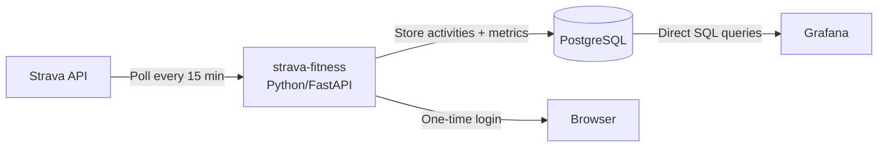

# Strava Fitness & Performance Tracker

A self-hosted Docker stack that syncs your Strava activities, calculates training load metrics (Relative Effort, Fitness, Fatigue, Form), and visualizes everything in Grafana.

## Architecture Overview



> [!IMPORTANT]
> **No Prometheus.** Grafana connects directly to PostgreSQL. This gives us full historical queries, the ability to recalculate metrics, and avoids the complexity of faking time-series into Prometheus.

## User Review Required

> [!WARNING]
> **Strava API Rate Limits:** Strava allows **100 requests per 15 minutes** and **1,000 requests per day**. Backfilling your history requires 1 request per activity (for HR streams) + 1 request per page of 200 activities. If you have e.g. 500 activities, the initial backfill will take roughly **30-45 minutes** as we'll need to respect rate limits. The service handles this automatically — just be patient on first run.

> [!NOTE]
> **OAuth Scopes Required:** When you authorize the app, it will request `activity:read_all` and `profile:read_all`. The first gives access to all your activities (including private ones). The second lets us pull your HR zones from Strava.

## Proposed Changes

### Project Structure

```
strava-fitness/
├── docker-compose.yml
├── .env.example
├── app/
│   ├── Dockerfile
│   ├── requirements.txt
│   ├── main.py              # FastAPI app, OAuth endpoints, scheduler
│   ├── config.py             # Settings from env vars
│   ├── database.py           # SQLAlchemy engine/session
│   ├── models.py             # DB models (activities, daily_metrics, tokens)
│   ├── strava_client.py      # Strava API wrapper with auto token refresh
│   ├── sync.py               # Activity sync + backfill logic
│   └── metrics.py            # TRIMP, CTL, ATL, TSB calculation engine
└── grafana/
    └── dashboards/
        └── fitness.json      # Pre-built Grafana dashboard
```

---

### Docker Compose

#### [NEW] `docker-compose.yml`

Three services:
- **`db`** — PostgreSQL 16 with a named volume for persistence
- **`app`** — The Python syncer/calculator (FastAPI)
- **`grafana`** — (optional, only if you don't already have one) Grafana with auto-provisioned PostgreSQL data source

Since you already have Grafana running, the compose file will include it commented out, and instead provide instructions for adding the PostgreSQL data source to your existing Grafana.

#### [NEW] `.env.example`

```env
STRAVA_CLIENT_ID=your_client_id
STRAVA_CLIENT_SECRET=your_client_secret
POSTGRES_USER=strava
POSTGRES_PASSWORD=changeme
POSTGRES_DB=strava_fitness
```

---

### Application Code

#### [NEW] `app/main.py` — FastAPI Application

Endpoints:
- `GET /` — Status page showing sync state, last activity, current CTL/ATL/TSB
- `GET /auth/strava` — Redirects to Strava OAuth login
- `GET /auth/callback` — Handles the OAuth callback, stores tokens in DB
- `GET /sync/status` — JSON endpoint showing backfill progress

Background tasks (via `asyncio` scheduler):
- **Every 15 minutes:** Check for new activities
- **On startup:** If no activities in DB, trigger full backfill

#### [NEW] `app/config.py` — Configuration

Reads from environment variables:
- `STRAVA_CLIENT_ID`, `STRAVA_CLIENT_SECRET`
- `DATABASE_URL` (constructed from Postgres env vars)
- `DEFAULT_MAX_HR` = 190 (fallback if Strava zones unavailable)
- `DEFAULT_REST_HR` = 60 (fallback)

#### [NEW] `app/database.py` — Database Setup

SQLAlchemy async engine + session factory. Auto-creates tables on startup.

#### [NEW] `app/models.py` — Database Schema

```
┌──────────────────────────┐
│ strava_tokens            │
├──────────────────────────┤
│ id (PK)                  │
│ access_token             │
│ refresh_token            │
│ expires_at (timestamp)   │
│ athlete_id               │
│ updated_at               │
└──────────────────────────┘

┌──────────────────────────┐
│ athlete_settings         │
├──────────────────────────┤
│ id (PK)                  │
│ athlete_id               │
│ max_hr                   │
│ rest_hr                  │
│ hr_zones (JSON)          │
│ updated_at               │
└──────────────────────────┘

┌──────────────────────────────────┐
│ activities                       │
├──────────────────────────────────┤
│ id (PK, = Strava activity ID)   │
│ athlete_id                       │
│ name                             │
│ sport_type                       │
│ start_date                       │
│ elapsed_time (seconds)           │
│ moving_time (seconds)            │
│ distance (meters)                │
│ average_heartrate                │
│ max_heartrate                    │
│ has_heartrate (bool)             │
│ suffer_score (Strava's own)      │
│ trimp (our calculated value)     │
│ hr_zones_distribution (JSON)     │
│ synced_streams (bool)            │
│ created_at                       │
└──────────────────────────────────┘

┌──────────────────────────┐
│ daily_metrics            │
├──────────────────────────┤
│ date (PK)                │
│ athlete_id               │
│ daily_trimp (sum)        │
│ ctl (fitness)            │
│ atl (fatigue)            │
│ tsb (form)               │
│ updated_at               │
└──────────────────────────┘
```

#### [NEW] `app/strava_client.py` — Strava API Wrapper

Key responsibilities:
- **Auto token refresh:** Before every API call, check if `expires_at < now`. If so, use the `refresh_token` to get a new `access_token` and persist the new `refresh_token` to the database. This solves your previous issue of having to re-authenticate.
- **Rate limiting:** Track remaining requests via Strava's `X-RateLimit-Usage` response header. If approaching the limit, sleep until the 15-minute window resets.
- **Methods:**
  - `get_athlete()` — Get athlete profile
  - `get_athlete_zones()` — Get HR zones (requires `profile:read_all`)
  - `get_activities(page, per_page, after)` — Paginated activity list
  - `get_activity_streams(activity_id, keys)` — HR time-series data

#### [NEW] `app/sync.py` — Sync Engine

**Backfill flow:**
1. Fetch all activities paginated (200 per page), oldest first
2. For each activity with `has_heartrate=True`, fetch HR stream data
3. Calculate TRIMP for each activity
4. Store in DB
5. After all activities are synced, recalculate daily metrics

**Incremental sync flow (every 15 min):**
1. Fetch activities with `after=<timestamp of last synced activity>`
2. Process new activities (same as backfill)
3. Recalculate daily metrics only for affected days

**Rate limit handling:**
- The backfill processes activities in batches
- After each batch, check `X-RateLimit-Usage` header
- If near limit, sleep until the 15-min window resets
- Progress is persisted to DB, so if the container restarts, it resumes where it left off

#### [NEW] `app/metrics.py` — The Math Engine

**1. TRIMP (Training Impulse) — "Relative Effort"**

For each activity with HR stream data:

```python
# Zone-based TRIMP (Strava-style)
# HR zones from Strava or defaults based on max_hr
ZONE_WEIGHTS = {
    1: 1.0,   # Recovery  (50-60% max HR)
    2: 2.0,   # Endurance (60-70% max HR)
    3: 3.0,   # Tempo     (70-80% max HR)
    4: 4.0,   # Threshold (80-90% max HR)
    5: 8.0,   # VO2max    (90-100% max HR)
}

trimp = 0
for zone, seconds_in_zone in time_per_zone.items():
    trimp += (seconds_in_zone / 60) * ZONE_WEIGHTS[zone]
```

For activities **without** HR data, we estimate TRIMP from duration and sport type:
```python
# Rough estimates per minute by sport
SPORT_TRIMP_PER_MIN = {
    "Run": 1.5,
    "Ride": 1.2,
    "Swim": 1.3,
    "Walk": 0.8,
    "Hike": 1.0,
    "default": 1.0,
}
trimp = duration_minutes * SPORT_TRIMP_PER_MIN.get(sport, 1.0)
```

**2. CTL (Chronic Training Load) — "Fitness"**

42-day exponentially weighted moving average:

```python
CTL_today = CTL_yesterday + (TRIMP_today - CTL_yesterday) / 42
```

**3. ATL (Acute Training Load) — "Fatigue"**

7-day exponentially weighted moving average:

```python
ATL_today = ATL_yesterday + (TRIMP_today - ATL_yesterday) / 7
```

**4. TSB (Training Stress Balance) — "Form"**

```python
TSB_today = CTL_yesterday - ATL_yesterday
```

> [!NOTE]
> TSB uses **yesterday's** CTL and ATL values, which represents your readiness at the start of today.

**5. Recalculation**

When triggered (after sync or on demand), iterates through every day from the first activity to today, calculating the rolling CTL/ATL/TSB and storing each day's values in `daily_metrics`. This means you can always re-run the calculation if you tweak the zone weights or fix HR zone settings.

---

### Grafana Dashboard

#### [NEW] `grafana/dashboards/fitness.json`

A pre-built dashboard with the following panels:

| Panel | Type | Description |
|-------|------|-------------|
| **Fitness & Freshness** | Time series | CTL (blue), ATL (red), TSB (green, filled area) over time |
| **Weekly Training Load** | Bar chart | Sum of TRIMP per week, colored by sport type |
| **Activity Log** | Table | Recent activities with name, sport, duration, TRIMP |
| **Current Status** | Stat panels | Today's CTL, ATL, TSB as big number gauges |
| **HR Zone Distribution** | Stacked bar | Per-activity breakdown of time in each HR zone |
| **Sport Breakdown** | Pie chart | TRIMP distribution by sport type |

All panels use direct PostgreSQL queries — no Prometheus involved.

---

### HR Zone Setup

On first sync, the service will:
1. Call `GET /api/v3/athlete/zones` to fetch your Strava HR zones
2. If zones are available → use them
3. If not → fall back to the standard formula:
   - Zone 1: 50-60% of Max HR
   - Zone 2: 60-70% of Max HR
   - Zone 3: 70-80% of Max HR
   - Zone 4: 80-90% of Max HR
   - Zone 5: 90-100% of Max HR
   - Where Max HR defaults to **190** and Resting HR to **60**

These can be overridden later via environment variables or the status page.

---

## Setup Flow (User Experience)

1. Copy `.env.example` to `.env`, fill in your Strava Client ID and Secret
2. Set the "Authorization Callback Domain" in your Strava API settings to `localhost` (or your server's hostname)
3. `docker compose up -d`
4. Open `http://your-server:8000/` in a browser
5. Click "Connect with Strava" → authorize → done
6. The service starts backfilling (progress visible at `/sync/status`)
7. Add the PostgreSQL data source to your Grafana instance
8. Import the provided dashboard JSON

After this one-time setup, everything runs automatically.

## Verification Plan

### Automated Tests
- Unit tests for TRIMP calculation against known HR zone distributions
- Unit tests for CTL/ATL/TSB math against hand-calculated examples
- Integration test: mock Strava API responses, verify activities are stored correctly

### Manual Verification
- Verify token auto-refresh works by waiting >1 hour after initial auth
- Verify backfill completes and matches the activity count in Strava
- Compare calculated TRIMP values against Strava's "Relative Effort" for a few activities (they won't match exactly since Strava's formula is proprietary, but should be in the same ballpark)
- Verify Grafana dashboard renders correctly with real data
