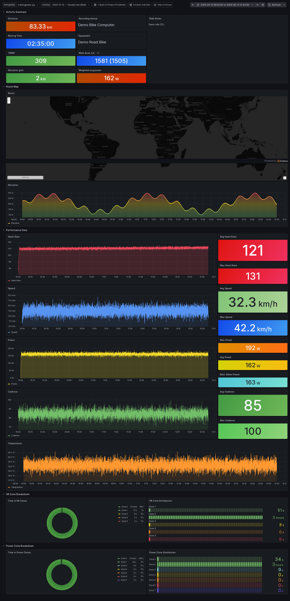
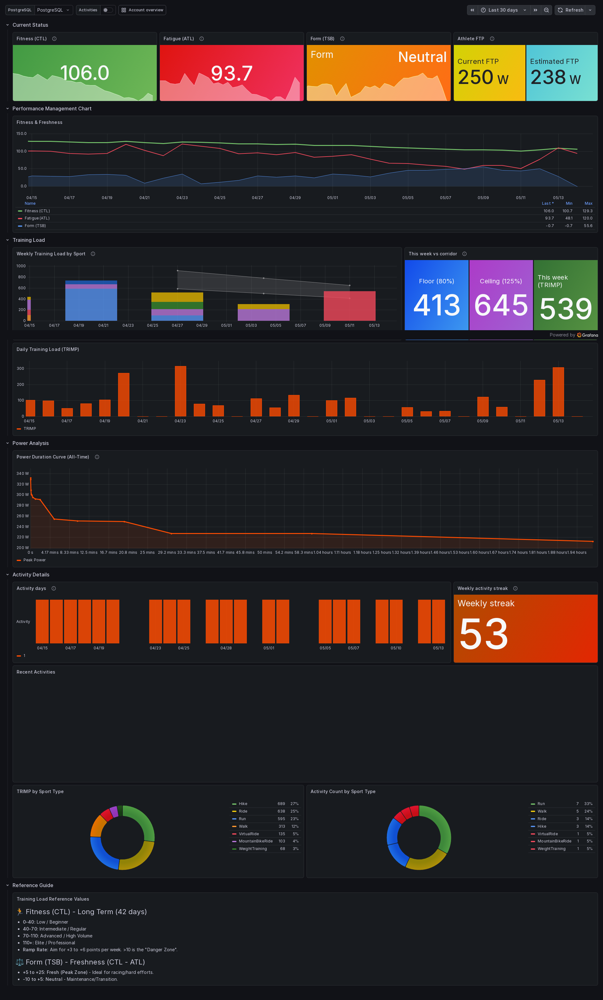
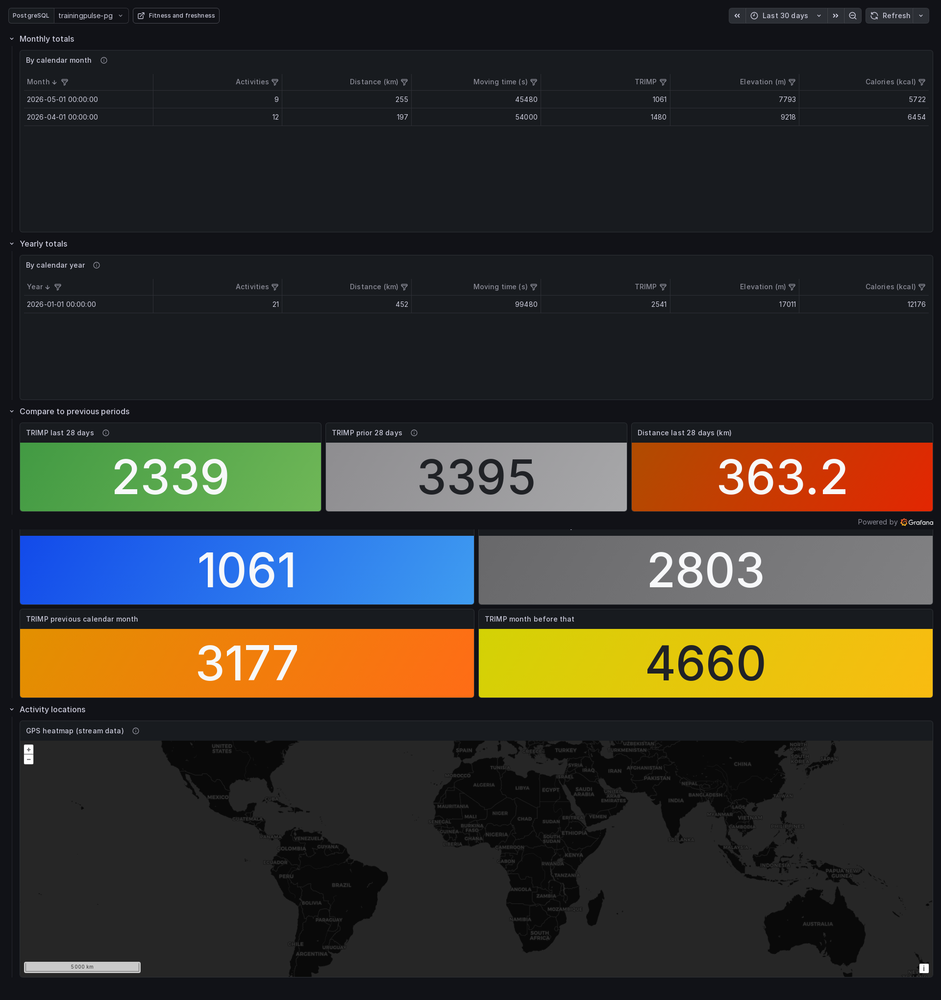
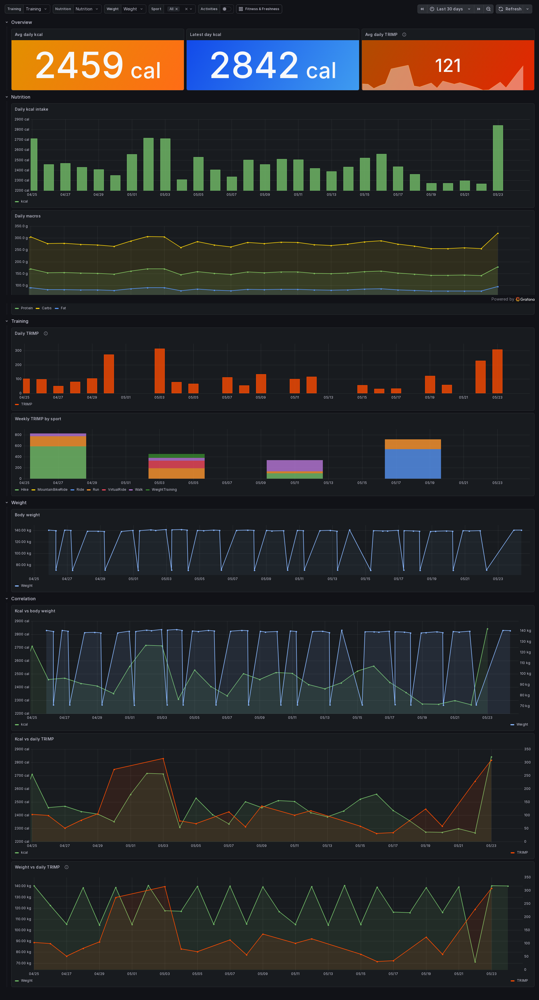

<p align="center">
  
</p>

# TrainingPulse

Self-hosted sync and dashboards for your **Strava** activities: PostgreSQL storage, training-load metrics (**TRIMP**, CTL, ATL, TSB, FTP estimates), and Grafana visualization.

## Strava trademark and API use

**TrainingPulse is not affiliated with, endorsed by, or sponsored by Strava.** “Strava” is a trademark of Strava, Inc. Each person who runs this stack must register their own Strava API application and comply with the [Strava API Agreement](https://www.strava.com/legal/api) and [Strava API Brand Guidelines](https://developers.strava.com/guidelines).

## Disclaimer

This project is largely AI-generated. The numbers it computes — including training load, fitness, fatigue, form, and FTP estimates — are informational only and **are not medical advice**. Verify anything you plan to act on, and consult a qualified professional for health or training decisions.

## Grafana dashboards

Example views from the bundled dashboards.

<table>
<tr>
<td align="center" valign="top" width="25%">
<a href="screenshots/activity_detail.png"></a><br />
<sub>Activity detail</sub>
</td>
<td align="center" valign="top" width="25%">
<a href="screenshots/fitness.png"></a><br />
<sub>Fitness &amp; Freshness</sub>
</td>
<td align="center" valign="top" width="25%">
<a href="screenshots/account_overview.png"></a><br />
<sub>Account overview</sub>
</td>
<td align="center" valign="top" width="25%">
<a href="screenshots/nutrition_training_weight.png"></a><br />
<sub>Nutrition &amp; weight</sub>
</td>
</tr>
</table>

## What you need

- Docker and Docker Compose
- A Strava API application: create one at [strava.com/settings/api](https://www.strava.com/settings/api) and note the **Client ID** and **Client Secret**. Set the **Authorization Callback Domain** to the hostname where you will run the stack (for example `localhost` or `myserver.local`).

## Setup

1. **Configure your environment.** Copy the example file and fill in your Strava credentials, a strong database password, and the URL the app will be reachable at:

   ```bash
   cp .env.example .env
   ```

   At minimum, set `STRAVA_CLIENT_ID`, `STRAVA_CLIENT_SECRET`, `POSTGRES_PASSWORD`, and `APP_BASE_URL` (used to build the OAuth callback).

2. **Start the stack.** From the repo root:

   ```bash
   docker compose up -d
   ```

   This brings up four containers: the FastAPI app on port `8000`, Grafana on port `3000`, the MCP service on port `8001`, and PostgreSQL (internal only).

3. **Connect Strava.** Open the app at `http://your-host:8000/` and click the official **Connect with Strava** button to complete OAuth. The initial backfill starts automatically — the same page shows live progress, and ongoing syncs run every 15 minutes from then on.

4. **Open Grafana.** Browse to `http://your-host:3000/`. The Postgres datasource **`trainingpulse`** and the bundled dashboards are provisioned automatically.

5. **Optional: connect an MCP client.** The read-only MCP service is available at `http://your-host:8001/mcp` for Cursor or another MCP-aware client. It exposes training summaries, activity lookup, gear usage, and sync-health tools over your network; keep it on a trusted network because tool results can include private training data. If you connect through a homeserver hostname or LAN IP, add it to `MCP_ALLOWED_HOSTS` in `.env`. When plugins are enabled (below), weight and nutrition tools are registered on the same endpoint.

## Optional plugins (Withings, FDDB)

TrainingPulse can load **in-process plugins** for body weight (Withings) and daily nutrition (FDDB). Plugin tables live in Postgres schemas `withings` and `fddb` inside the same database as core data. Addon dashboards appear in Grafana under the **Addons** folder.

1. Set `ENABLED_PLUGINS=withings,fddb` in `.env` (comma-separated; omit or leave empty for core-only).
2. Add plugin credentials (`WITHINGS_CLIENT_*`, or `FDDB_USER` / `FDDB_PW` / `FDDB_COOKIE` — see `.env.example`).
3. Restart: `docker compose up -d --build`

| Plugin | Setup UI | Partner callback (Withings) |
|--------|----------|---------------------------|
| Withings | `/plugins/withings/` | `{APP_BASE_URL}/plugins/withings/get_token` |
| FDDB | `/plugins/fddb/` | Cookie from browser (see `.env.example`) |

## What data lives where

**Pulled from Strava and stored locally:**

- Activity summaries (name, sport, times, distance, elevation, average/max HR and power, kilojoules, calories, device and gear, suffer score) — merged from the list and detail endpoints.
- Raw telemetry streams (heart rate, power, cadence, temperature, grade, GPS, etc.) for every activity that has them.
- OAuth tokens (auto-refreshed) and your Strava athlete profile values used for HR zones and FTP, unless overridden in the environment.

**Computed by this project:**

- Per-activity **TRIMP** (heart-rate zone-weighted training load), with a sport-based estimate when an activity has no HR data.
- Time spent in each **heart-rate and power zone** per activity.
- **Best 20-minute power** and an **estimated FTP** (95% of best 20-minute power).
- Daily **CTL (Fitness)**, **ATL (Fatigue)**, and **TSB (Form)**

## Overriding HR and FTP

Out of the box Max HR is `190`, Resting HR is `60`, and FTP comes from your Strava profile (falling back to `200`). Override any of them by setting `MAX_HR`, `REST_HR`, or `FTP` in your `.env`. See [`DEVELOPERS.md`](DEVELOPERS.md) for the full precedence rules, including how to let Strava's profile values drive Max HR and zones.

## Going further

For architecture, the HTTP API, the full list of environment variables, and how each metric is calculated, see [`DEVELOPERS.md`](DEVELOPERS.md).

## License

This program is free software: you can redistribute it and/or modify it under the terms of the **GNU General Public License v3.0** as published by the Free Software Foundation. See the [`LICENSE`](LICENSE) file for the full text.
