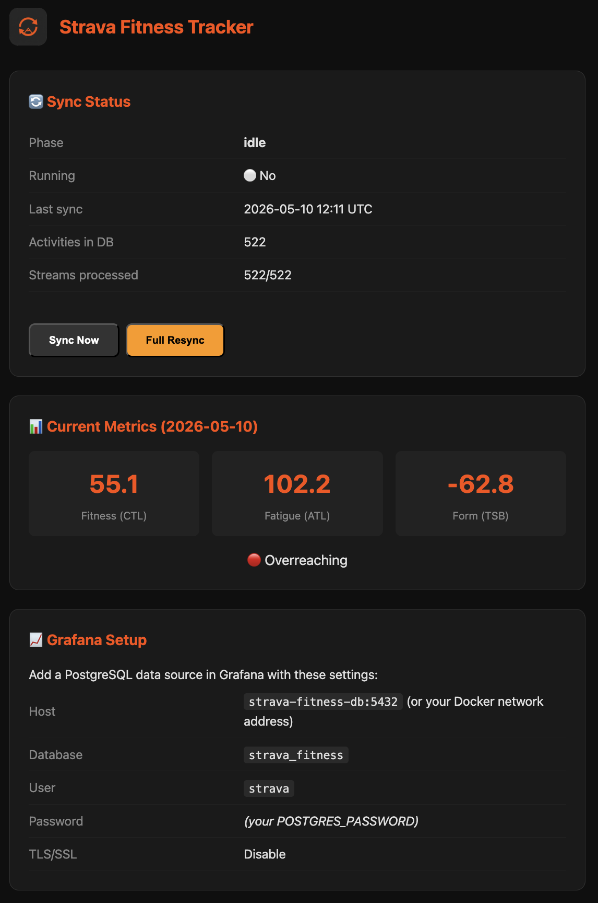
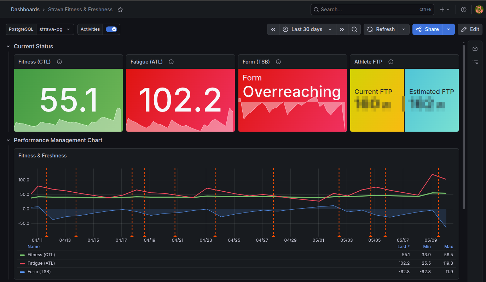
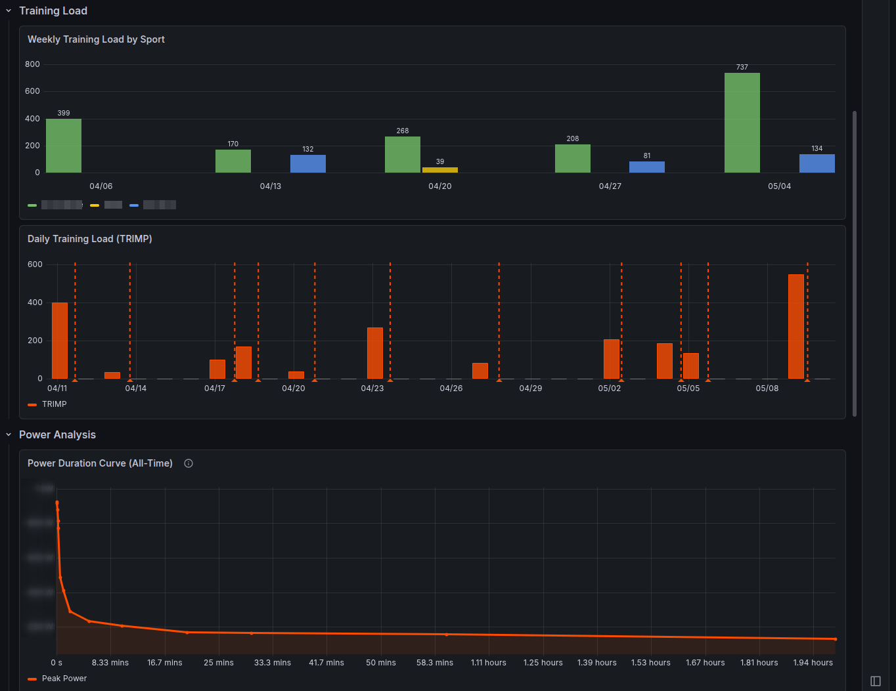
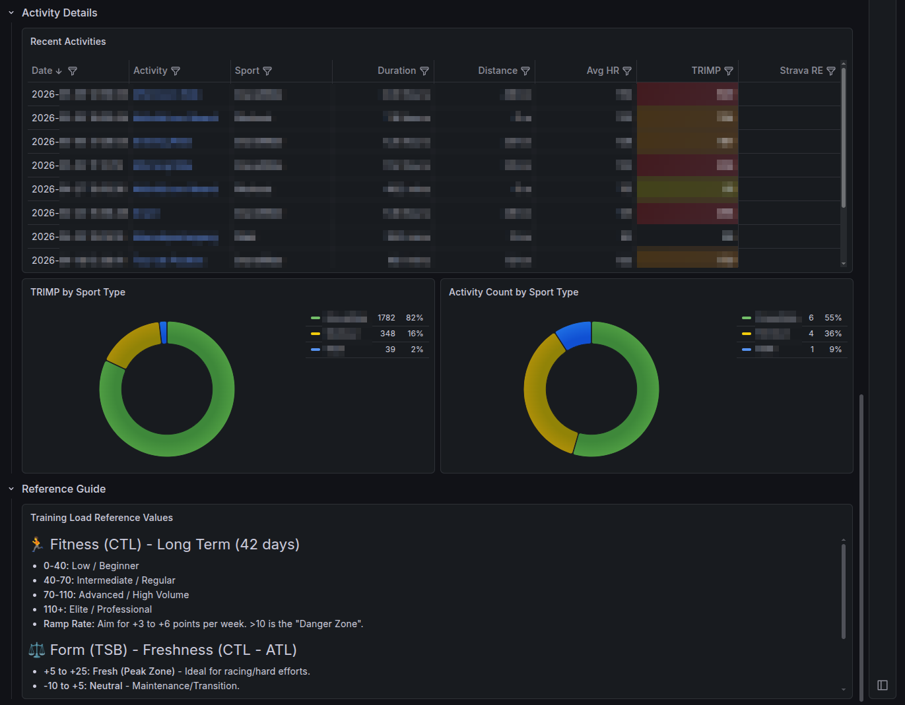
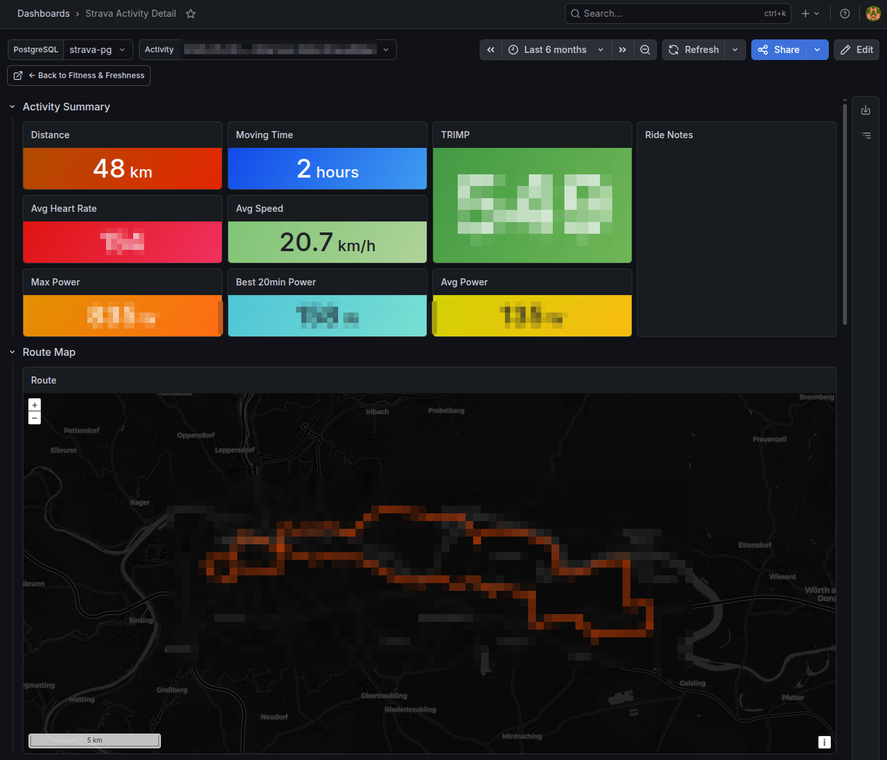
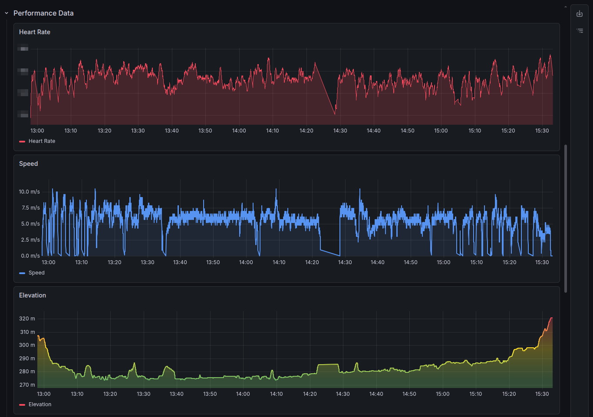
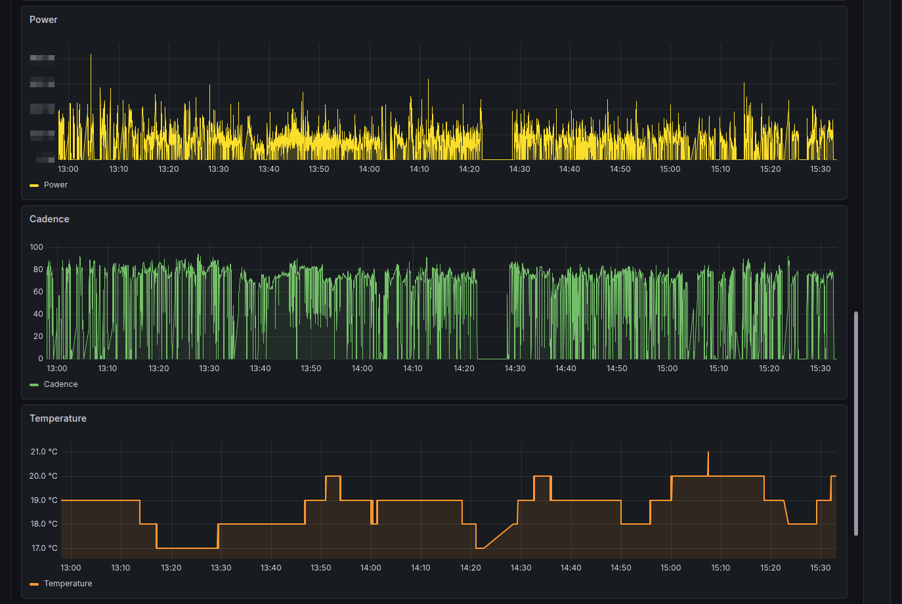
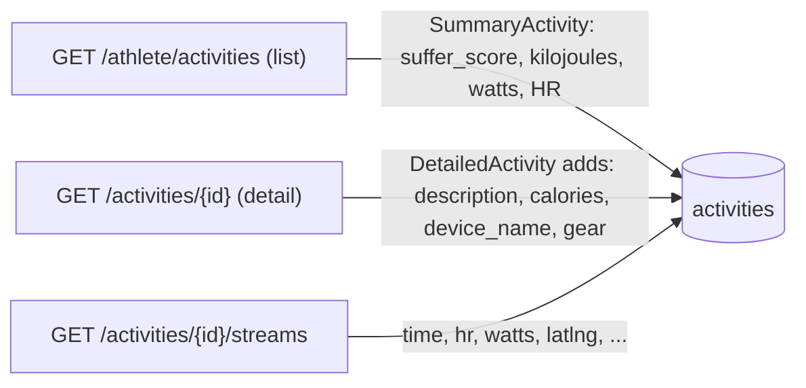

<p align="center">
  
</p>

# Strava Fitness & Performance Tracker

A self-hosted Docker stack that syncs your Strava activities, calculates training load metrics, and visualizes everything in Grafana.

## What It Does

- **Syncs all activities** from your Strava account (full historical backfill + ongoing polling). Backfill first walks **`GET /athlete/activities`** page by page (up to 200 per page) and upserts every activity **without** blocking pagination on detail calls. A separate pass then calls **`GET /activities/{id}`** for each row until **calories**, **ride notes** (`description`), **kilojoules**, and other summary fields are merged (see `strava_detail_synced` in the database). Detail and stream fetches run with **bounded concurrency** (default 5) and **sleep on HTTP 429** so they use Strava's read quota efficiently (~100 reads / 15 minutes by default); whatever doesn't fit in the current rate-limit window continues automatically on the next scheduled sync.
- **Metadata & notes**: Activity descriptions and calories are taken from the **detailed** activity API (the list endpoint often omits them).
- **Calculates Relative Effort (TRIMP)** from heart rate stream data.
- **Power Analysis**: Tracks Power (Watts) and calculates **Best 20-minute Power** and **Estimated FTP**.
- **Full Telemetry**: Persists raw streams for Heart Rate, Power, Cadence, Temperature, and Grade.
- **Tracks Fitness, Fatigue, and Form** (CTL/ATL/TSB) — the same "Fitness & Freshness" chart that requires a Strava subscription.
- **Handles OAuth automatically** — authenticates once, never expires.
- **Respects Strava rate limits** — sleeps when approaching limits, resumes on restart.

## Dashboards

### Status


### Grafana
#### Fitness & Freshness



*The main performance management chart tracking Fitness (CTL), Fatigue (ATL), and Form (TSB).*

#### Activity Analysis



*Detailed telemetry breakdown including Heart Rate, Power, Cadence, and Temperature streams.*

## Metrics Explained

| Metric | Also Known As | Description |
|--------|--------------|-------------|
| **TRIMP** | Relative Effort | Heart rate zone–weighted training load per activity |
| **CTL** | Fitness | 42-day exponential moving average of daily TRIMP |
| **ATL** | Fatigue | 7-day exponential moving average of daily TRIMP |
| **TSB** | Form | CTL − ATL. Positive = fresh, negative = fatigued |
| **Best 20m** | — | Highest average power sustained for 20 continuous minutes |
| **Est. FTP** | — | 95% of your best 20-minute power |

## Quick Start

### 1. Configure

```bash
cp .env.example .env
# Edit .env with your Strava Client ID and Secret
```

Get your Client ID and Secret from [strava.com/settings/api](https://www.strava.com/settings/api).

Set the **Authorization Callback Domain** to your server hostname (e.g., `localhost` or `myserver.local`).

### 2. Start

```bash
docker compose up -d
```

### 3. Authorize

Open `http://your-server:8000/` and click **Connect with Strava**.

The initial backfill will start automatically. Check progress at `http://your-server:8000/`.

### 4. Connect Grafana

Add a **PostgreSQL** data source in Grafana:

| Setting | Value |
|---------|-------|
| Host | `strava-fitness-db:5432` (adjust for your Docker network) |
| Database | `strava_fitness` |
| User | `strava` |
| Password | *(your POSTGRES_PASSWORD from .env)* |
| TLS/SSL | Disable |

Then import the dashboards from `grafana/dashboards/` (at minimum `fitness.json`; also `activity_detail.json` and `account_overview.json` for drill-down and rollups).

## Database upgrades (manual)

The app uses `create_all` on startup for **new** databases only. If you already have a PostgreSQL volume from an older version, apply DDL yourself when models change.

**`activities.strava_detail_synced`** (tracks whether `GET /activities/{id}` has been merged for that row; used to resume detail work across syncs):

```sql
ALTER TABLE activities ADD COLUMN IF NOT EXISTS strava_detail_synced BOOLEAN NOT NULL DEFAULT false;
```

After adding the column, the next sync will queue detail merges for all rows (in batches). A full resync also clears this flag so details are re-fetched.

## Architecture

```
Strava API → [strava-fitness app] → PostgreSQL → Grafana
               (FastAPI + Python)
```

- **No Prometheus needed** — Grafana queries PostgreSQL directly
- Activities + HR streams stored in PostgreSQL
- Background scheduler polls Strava every 15 minutes
- Token auto-refresh ensures continuous operation

### Strava endpoints and the fields they provide

A single activity is assembled from three separate Strava endpoints. The list endpoint is cheap (one call per 200 activities), but `description`, `calories`, `device_name`, and full `gear` info are only available on the per-activity detail endpoint — and streams are a third, separate per-activity call. That's why a full backfill costs roughly `2N + N/200` requests against Strava's 100 / 15-min and 1000 / day limits.



## API Endpoints

| Endpoint | Description |
|----------|-------------|
| `GET /` | Status page with current metrics |
| `GET /auth/strava` | Start Strava OAuth flow |
| `GET /sync/status` | JSON sync status (for monitoring) |
| `POST /sync/trigger` | Manually trigger a sync |
| `POST /sync/full` | Full historical resync (re-list all activities from Strava, reprocess streams) |

## Environment Variables

| Variable | Default | Description |
|----------|---------|-------------|
| `STRAVA_CLIENT_ID` | — | Your Strava API client ID |
| `STRAVA_CLIENT_SECRET` | — | Your Strava API client secret |
| `POSTGRES_USER` | `strava` | PostgreSQL username |
| `POSTGRES_PASSWORD` | `changeme` | PostgreSQL password |
| `POSTGRES_DB` | `strava_fitness` | PostgreSQL database name |
| `APP_BASE_URL` | `http://localhost:8000` | Public URL of the app (for OAuth callback) |
| `MAX_HR` | *(Strava)* | **Override** for Max HR. If set, ignores Strava zones. |
| `REST_HR` | *(Strava)* | **Override** for Resting HR. |
| `FTP` | *(Strava)* | **Override** for FTP. |
| `SYNC_INTERVAL_MINUTES` | `15` | Polling interval |
| `SYNC_DETAIL_CONCURRENCY` | `5` | Parallel `GET /activities/{id}` requests during detail merge. Strava's 15-min quota is the real ceiling; higher values just keep workers fed. Set to `1` to restore fully sequential behavior. |
| `SYNC_STREAMS_CONCURRENCY` | `5` | Parallel `GET /activities/{id}/streams` requests during stream processing. Same caveats as above. |

### Overriding Metrics

By default, the app fetches your **Max HR** and **FTP** from your Strava profile. However, if you want to manually set these (e.g., if Strava's auto-detected Max HR is incorrect), you can set `MAX_HR`, `REST_HR`, or `FTP` in your `.env` file.

**Note:** If you override `MAX_HR` or `REST_HR`, the app will ignore any custom heart rate zones from Strava and calculate consistent percentage-based zones instead.
